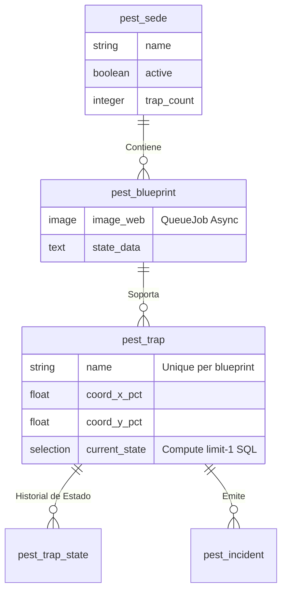
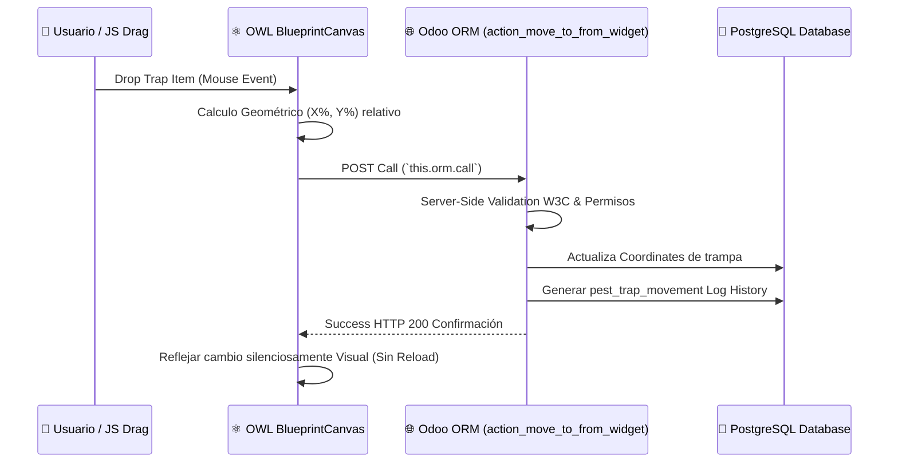

# Advanced System Architecture: `pest_control` v2

Bienvenidos a la topología técnica del módulo para desarrollo en el framework de **Odoo 19**.

## Core Stack
- **ORM / Backend**: Programación modular orientada a objetos usando el ORM *Active Record* nativo de Odoo (Python 3.12).
- **Frontend / Reactividad**: Integrado por completo bajo la *Odoo Web Library* (OWL), facilitando un VirtualDOM.
- **Background Jobs**: Procesamiento de tareas de CPU intenso ejecutado en instancias separadas de hilos OCA `queue_job`.
- **UI System**: Estandarización de Odoo Design Tokens (*Bootstrap 5 core*).

---

## 🏗️ 1. Entity-Relationship Schema (ERD)

Este ecosistema minimiza deudas técnicas basándose en una cascada de entidades relacionales hacia dependencias One2many enlazadas y optimizadas de índices múltiples en PostgresSQL.

---

## 🚀 2. Patrones de Rendimiento y Escalabilidad

Al someterse bajo auditorías *AI Review* a nivel Enterprise, el código fuente mutó para adoptar estrategias seguras en bases de miles de transacciones (*IoT Sensors* o redes industriales macro):

1. **Evitación Crítica Iterativa N+1**: Desaprobado el conteo de objetos dependientes vía `len()`. Todos los campos con decorador `@api.depends` en las clases `pest.sede` ejecutan las metodologías agrupadas de memoria RAM `self.env['model']._read_group()`. 
2. **Índices y DISTINCT ON (O(1)**): La captura del estado funcional vigente (*funciona, en_reparacion, etc*) de la trampa no es un bucle iterativo que lee la base `_ids` (generando memory-overflow); inyectamos código SQL asertivo con `SELECT DISTINCT ON` y limitamos a `depth=1` indexado de los eventos ordenados por Timestamp.
3. **QueueJob Media Optimization**: Subir mapas corporativos crudos (ej. resoluciones de 6,000 Píxeles en memoria) detenía los *Web Workers* bloqueando el puerto total. El redimensionamiento Odoo estandar `image_process(size/quality)` ha sido encapsulado bajo `with_delay()` asíncrono para mutarlo luego en formato web ágil sin colgar las métricas operativas al usuario.

---

## 🧩 3. Arquitectura del Componente Interactivo (Canvas UI)

El ciclo de la comunicación de arrastre con respuesta de interfaz, utiliza el canal API Transaccional de OWL (`res.update`) vinculado contra *Remote Procedure Calls* (RPC) limpios en Backend (evitando ensuciar overrides genéricos `write`):

---

## 🔒 4. Odoo Security Matrix
El núcleo de accesibilidad de vistas, botones MVC nativos de Python es gobernado por los Grupos definidos en el archivo `security/pest_security.xml`:

*   `group_pest_user`: Auditor base con validación Read-Only sobre modelo central y denegaciones `ir.model.access.csv` en borrados de trazabilidad histórica.
*   `group_pest_technician`: Estatus Write de `pest_trap` con barrera HTTP controlada.
*   `group_pest_manager`: Overrides críticos (ej. `action_supervisor_approval` para dar visto bueno final en `pest_evidence`).
